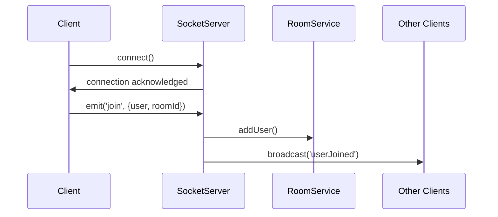
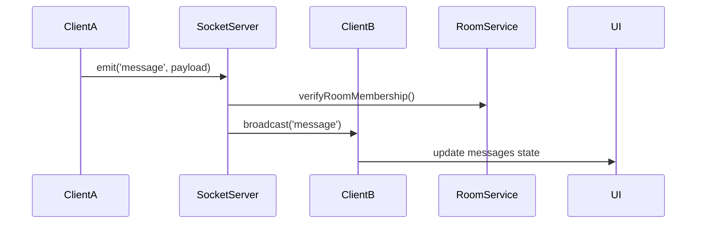
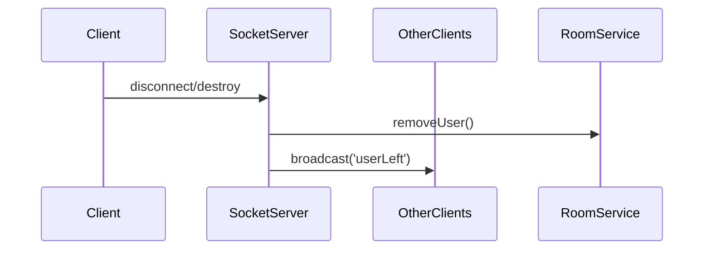

# Notes

Here's a detailed explanation of how the chat application works with a textual diagram:

## **Technologies Used**

1. **React** - Frontend UI framework
2. **Socket.io** - Real-time communication library
3. **TypeScript** - Type-safe JavaScript
4. **Node.js/Express** - Backend server
5. **Firebase Auth** - User authentication

---

### **Architecture Diagram (Text Representation)**

```bash
[React Client] <--WebSocket--> [Socket.io Server] <--> [Room Service]
     |                               |
     |--- Authentication (Firebase)--|
     |--- UI Components ------------|

Data Flow:
1. User Auth → 2. Connection → 3. Room Join → 4. Message Exchange → 5. Disconnect
```

---

### **Workflow Breakdown**

#### **1. Connection Establishment**



#### **2. Message Flow**



#### **3. Disconnection Handling**



---

### **Key Components Explained**

#### **Client-Side (React)**

1. **Connection Setup**

```tsx
const socket = io("http://localhost:4000", {
  autoConnect: false, // Manual connection control
});
```

2. **Room Joining**

```tsx
useEffect(() => {
  socket.connect();
  socket.emit("join", { user, roomId });
  return () => {
    socket.emit("leave", { roomId });
    socket.disconnect();
  };
}, [user, roomId]);
```

3. **Message Handling**

```tsx
socket.on("message", (message: Message) => {
  setMessages((prev) => [...prev, message]);
});
```

#### **Server-Side (Socket.io)**

1. **Connection Manager**

```ts
io.on("connection", (socket) => {
  // Handle all events
  socket.on("join", handleJoin);
  socket.on("message", handleMessage);
  socket.on("disconnect", handleDisconnect);
});
```

2. **Room Service (State Management)**

```ts
class RoomService {
  private connectedUsers = new Map<string, ConnectedUser>();

  addUser(socketId: string, user: User, roomId: string) {
    // Add user to room tracking
  }

  removeUser(socketId: string) {
    // Clean up user from room
  }
}
```

---

### **Key Features Implementation**

1. **Real-time Updates**

- Uses Socket.io's `emit()` and `on()` methods
- Event-driven architecture for instant messaging

2. **User Presence**

- `userJoined`/`userLeft` events broadcast to room
- RoomService tracks active users

3. **Message Persistence**

- Client-side state management (React useState)
- (Optional) Could add database integration

4. **Error Handling**

```ts
socket.on("error", (error: string) => {
  toast.error(error);
});
```

5. **Connection Reliability**

- Auto-reconnect built into Socket.io
- Ping/pong heartbeat mechanism

```ts
// Server-side
const heartbeatInterval = setInterval(() => {
  socket.emit("ping");
}, 15000);

// Client-side
socket.on("ping", () => {
  socket.emit("pong");
});
```

---

### **Data Flow Summary**

1. User authenticates (Firebase)
2. Establishes WebSocket connection
3. Joins specific room channel
4. Sends/receives messages in real-time
5. Clean disconnect on component unmount

---

### **Potential Enhancements**

1. **Message Persistence** - Add database storage
2. **Read Receipts** - Track message views
3. **Typing Indicators** - `socket.emit('typing')`
4. **File Sharing** - Handle binary data
5. **Message History** - Load previous messages
6. **Moderation** - Add admin controls
7. **End-to-End Encryption** - Secure messaging

This architecture provides a solid foundation for real-time communication while maintaining scalability and type safety through TypeScript. The combination of React's state management and Socket.io's event-driven model enables efficient real-time updates.
